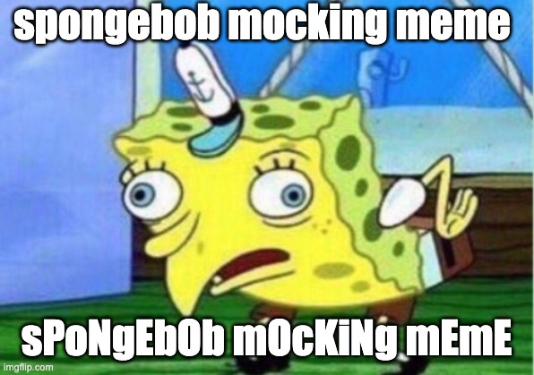

# Spongebobify

a barebones chrome extension to generate text in the style of the spongebob mocking meme:

- the first letter of a word is always lowercase, alternates after
- non-alphabet characters are ignored, but the alphabet letter following is considered the first of a new word
- no permissions necessary

---

1. navigate to [chrome://extensions/](chrome://extensions/)

1. click `Load unpacked`

1. select the `dist` directory

1. to make any changes, run `npm install` to install the dependencies and `npm run build` to output the compiled changes to the `dist` directory
